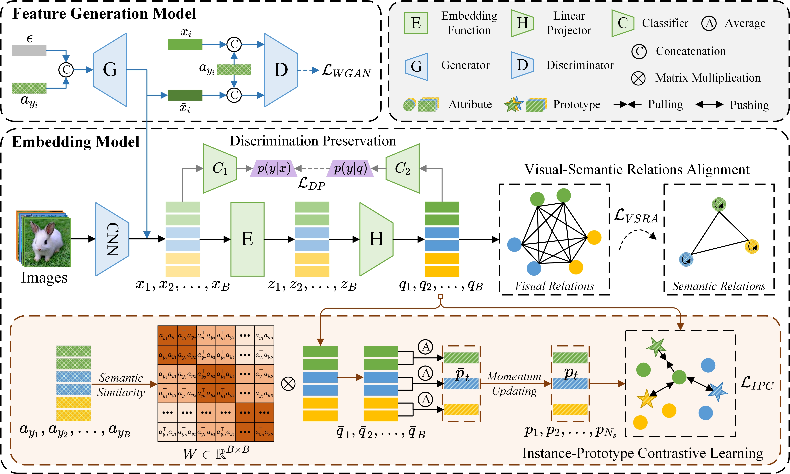

# **Relation Extrapolation for Generalized Zero-Shot Learning**

This work is submitted to IEEE Transactions on Circuits and Systems for Video Technology publication information (TCSVT)

:fire: This is the official PyTorch implementation of our work. :fire:

## News
* **2024-07-10** :rocket: We release the code for RE-GZSL.

## Overview


## Getting Started

### Installation

The implementation runs on
- Python 3.7
- Torch 1.8.0+cu101
- Torchvision 0.9.0
- CUDA 10.1
- scikit-learn
- pillow
- numpy

## Training
Example of AWA1:
```
python main.py --dataset AWA1 --way 8 --shot 32 --c_batch_size 5000 --syn_num 5000 --c_epoch 30 --epoch 100 --mad 0.8 --seen_Neighbours 4 --gamma 0.8 --contrast_ratio 0.1 --manualSeed 438
```

